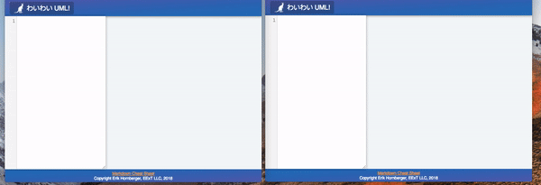

# Wai Wai UML
Wai Wai UML is an experiment in mob UML design. Each person in the room has
the same page open on their computer, and all members can interactively edit
the Plant UMLi markdown at anytime, resulting in an automatic realtime update
on all other user's screens.

The hope is that this will make it quick and easy to rapidly express, evaluate,
and iterate on design ideas. If you try it out, please give me your feedback!

## Demo
If you're lucky, there might be a live demo of WaiWaiUML running at 
[waiwaiuml.live](http://www.waiwaiuml.live). If not, you'll have to run it yourself
in docker-compose to check it out.

## Setup
1. Clone this repo
2. `cd` into `waiwai-uml` and run `yarn install` or `npm install`
3. Run `docker-compose up` to launch the web server, wesocket signaling server, and plant uml server all at once.
4. Connect on port 80

